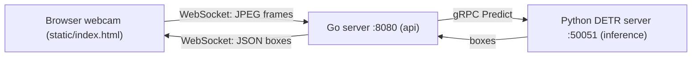

# Boxer

Real-time webcam object detection. The browser streams webcam frames to a Go web server, which forwards each frame over gRPC to a Python inference server running a HuggingFace DETR (ResNet-50) model. Detected bounding boxes are sent back and drawn on a canvas overlay.

## Architecture

- The browser (`api/static/index.html`) captures a webcam frame every 200ms and sends the JPEG bytes over `ws://localhost:8080/ws`.
- The Go server (`api/cmd/main.go`) keeps the latest frame, calls the gRPC `Predict` RPC, and returns the detections as JSON.
- The Python gRPC server (`inference/main.py` + `inference/infer.py`) runs DETR object detection on `[::]:50051`.
- The shared contract lives in `proto/prediction.proto` (the `Model.Predict` service).



## Repository layout

- `proto/`: the shared protobuf/gRPC contract (`prediction.proto`). Generated code is committed into each component.
- `inference/`: the Python gRPC inference server (DETR model, served on port `50051`).
- `api/`: the Go web server and webcam frontend (served on port `8080`).

## Prerequisites

- Python 3.13 and [uv](https://docs.astral.sh/uv/) (for the inference server).
- Go 1.24+ (for the API server).
- A webcam and a modern browser.
- Only needed if you regenerate protobuf code: `protoc`, plus `protoc-gen-go` and `protoc-gen-go-grpc` for the Go side.

## Inference server (`inference/`)

1. Install dependencies:

```bash
cd inference
uv sync
```

2. Provide the model weights. The repo commits `model_store/config.json` and `model_store/preprocessor_config.json`, but the weights file (`model_store/pytorch_model.bin`) is gitignored (`*.bin`) and must be supplied yourself. The committed config is a `DetrForObjectDetection` model with a `resnet50` backbone (`facebook/detr-resnet-50`). One way to fetch the weights:

```bash
cd inference
uv run python -c "from huggingface_hub import hf_hub_download; import shutil; \
shutil.copy(hf_hub_download('facebook/detr-resnet-50', 'pytorch_model.bin'), 'model_store/pytorch_model.bin')"
```

3. Run the server (serves on `:50051`):

```bash
make run
# or, equivalently:
uv run python main.py
```

## API / web server (`api/`)

1. Download Go dependencies:

```bash
cd api
go mod download
```

2. Run the server (serves on `:8080`, static files from `./static`):

```bash
cd api
go run ./cmd
```

3. Open `http://localhost:8080` in your browser and allow webcam access. Bounding boxes are drawn over the video.

## Run order

1. Start the inference server (`inference/`) first so it is ready on `:50051`.
2. Start the API server (`api/`) on `:8080`.
3. Open `http://localhost:8080` in your browser.

## Regenerating protobuf code (optional)

Only needed if you change `proto/prediction.proto`.

- Python (`inference/`): runs `grpc_tools.protoc`, then fixes the generated import via `tooling/fix_proto.py`:

```bash
cd inference
./generate_proto.sh
```

- Go (`api/`): runs `protoc` with the Go and gRPC plugins:

```bash
cd api
./generate_proto.sh
```

## Notes

- Addresses are hardcoded: the inference server listens on `:50051`, the API server on `:8080`, and the API connects to the predictor at `localhost:50051` (`api/cmd/main.go`).
- Inference uses CUDA if a GPU is available, otherwise it falls back to CPU (`inference/infer.py`).

